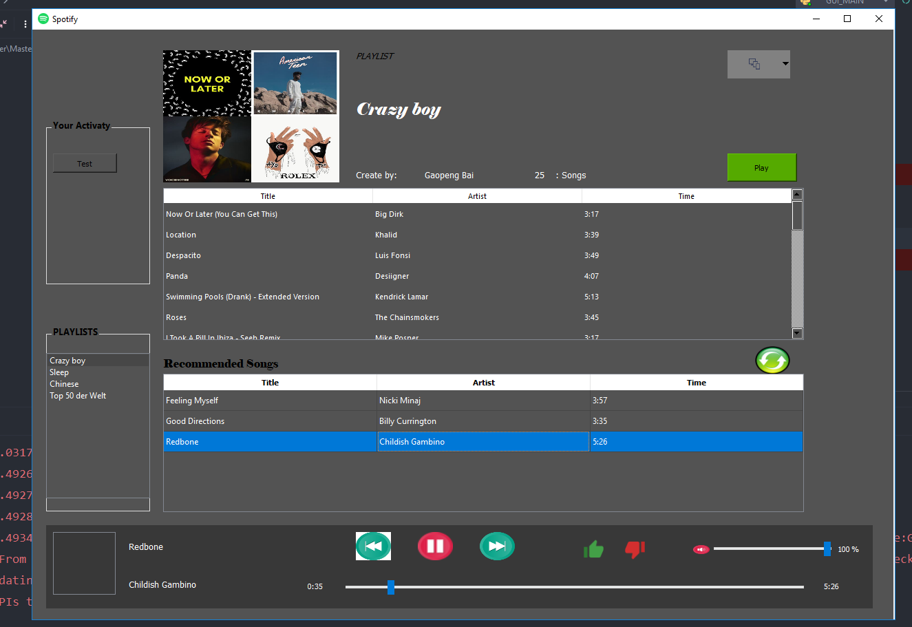

# My Spotify Client with MANN recommendation system

## Introduction

To verify that the [results of this study](https://github.com/Gaopeng-Bai/MANN_model.git) are objective, I use the [spotify python API](href{https://spotipy.readthedocs.io/en/latest/) to build an application (graphical user interface) that contains [MANN](https://arxiv.org/pdf/1605.06065.pdf) algorithms to recommend next song to user. 


## Requirements

* Make sure you have Python or Conda installed
* Install package described in requirement file.
* This application require Spotify premium account.

    * [Register Spotify dashboard](https://developer.spotify.com/dashboard/login) to get your credentials.

    * More details please check the [documents](https://spotipy.readthedocs.io/en/latest/)

* Set environment variables:

    ```
    SPOTIPY_CLIENT_ID= xxx

    SPOTIPY_CLIENT_SECRET= xxx
        
    SPOTIPY_REDIRECT_URI='your-app-redirect-url'

    ```


* Make sure the pre-trained model that generate by [Model](https://github.com/Gaopeng-Bai/MANN_model.git) already exited in ../data_resources/save_data.

## Usage

* Run this application with your Spotify ID.

    Login your Spotify client -> Click on your profile photo -> The menu button under your photo. 

    When you're on your account and find your account sharing link, the characters after /user will be the user id.

    Run program: python xxx.py user on the console.  Or set your IDE.

* Authorization. 

    The program will jump to the browser with your redirect URL (whatever it is). Copy the URL represent in browser to command line, then press Enter to go.

* Operationes

    This application reads the user's own playlists, and when the user clicks on the specific playlist, it will show all song information in the playlist table on application. Click the play button to remotely control the existing Spotify official terminal (official android application or official desktop application), click on the upper right corner to seek the current online terminal and connect the terminal. After the playlist is shown on the playlist table, user can click the refresh button to get the items of the recommended song. The all songs displayed in the application can be played by double-clicking. The buttons at the bottom of thumb-down and thumb-up are used to collect real-time feedback from the user. My application also has the necessary functions of the player. My application is a client that connects to the official music database of Spotify and can directly extract the current user's playlist information from database. After the user playlist data is prepossessed, the data is input into the trained model for recommended calculation. Use the model's output to query song details from the database. The client provides a user feedback function, which can adjust the input playlist according to the feedback, and then recommend new songs to the user. At this point, if the user submits positive feedback, the current song will be added as a new input to the original input sequence of the recommendation system. If negative feedback is submitted, this song will no longer appear in recommendations currently in the playlist as input. If no feedback is provided, the recommended input element will be the same as the playlist owned by the user.